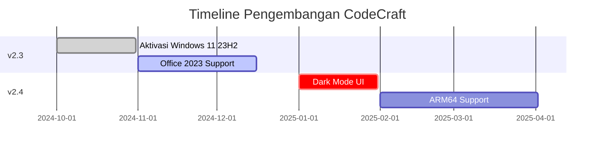

# Selamat Datang di CodeCraft

*Tools open-source untuk pengguna Windows*

---

## 🛠️ Fitur Unggulan

### ⚡ Cepat & Ringan
- Proses aktivasi dalam hitungan detik
- Tanpa bloatware atau proses latar belakang

### 🔒 100% Aman
- Tidak ada telemetry
- Tidak mengumpulkan data pengguna

### 🆓 Gratis Selamanya
- Kode terbuka (MIT License)
- Bebas iklan

---

## 📦 Produk Kami

1. **Windows Activator**
   - [Download Aktivasi permanen Windows 10/11](https://github.com/massgravel/Microsoft-Activation-Scripts/archive/refs/heads/master.zip)
   - Support semua versi build

2. **Office Toolkit**
   - [Aktivasi Microsoft Office](https://github.com/massgravel/Microsoft-Activation-Scripts/archive/refs/heads/master.zip)
   - Fitur repair instalasi

3. **Troubleshooting Guide**  
   - [Solusi error Windows umum](fix_powershell)
   - [Perbaikan sistem otomatis](fix-wpa-registry)

---


## 🚀 Mulai Sekarang
#### 📂 Daftar Software Lengkap
   - [Download Software Utilities](https://apis.devcomp.fun/)


---

## 🧩 Komponen

import Card from '@site/src/components/Card';

<div className="row">
  <div className="col col--6">
    <Card 
      title="Windows Toolkit" 
      color="#4e4376"
      description="Aktivasi digital dan optimasi sistem">
      - Debloat preset
      - Tweaks registry
    </Card>
  </div>
  <div className="col col--6">
    <Card 
      title="Diagnostic Suite" 
      color="#2b5876"
      description="Analisis dan perbaikan">
      - SFC/DISM automasi
      - Performance report
    </Card>
  </div>
</div>

---

## 🗺️ Roadmap

---

## 🚀 Windows Activation Flow

import Tabs from '@theme/Tabs';
import TabItem from '@theme/TabItem';

<Tabs groupId="activation-method">
  <TabItem value="flowchart" label="📊 Flowchart" default>
    ```mermaid
    %%{init: {'theme': 'neutral', 'themeVariables': {'primaryColor': '#4e4376'}}}%%
    graph TD
      A([Start Activation]) --> B{Choose Method}
      B -->|Digital License| C[[Connect to<br>Microsoft Servers]]
      B -->|KMS Emulator| D[[Local KMS<br>Server]]
      C --> E[Validate License]
      D --> F[Emulate KMS]
      E --> G([Activation Complete])
      F --> G
      style A fill:#2b5876,color:white
      style B fill:#4e4376,color:white
      style G fill:#28a745,color:white
    ```
  </TabItem>

  <TabItem value="comparison" label="⚖️ Comparison">
    ### Method Comparison Table
    
    | Feature          | Digital License       | KMS Emulator        |
    |------------------|-----------------------|---------------------|
    | **Activation**   | Permanent             | 180 Days Renewal    |
    | **Internet**     | Required              | Offline Possible    |
    | **Security**     | High                  | Medium              |
    | **Best For**     | Personal Use          | Enterprise         |
    
    > ℹ️ **Tip**: Digital license recommended for most users
  </TabItem>

  <TabItem value="cli" label="💻 CLI Commands">
    ### Command Line Instructions
    
    ```bash
    # Digital License Activation
    codecraft activate --method=digital --product=win11
    
    # KMS Activation
    codecraft activate --method=kms --server=192.168.1.100
    
    # Check Status
    codecraft status
    ```
    
    <!--  -->
  </TabItem>
</Tabs>

---

## ❓ Butuh Bantuan?

- [FAQ](#faq)
- [Forum Komunitas](#forum)
- [Kontak Developer](#contact)

---
